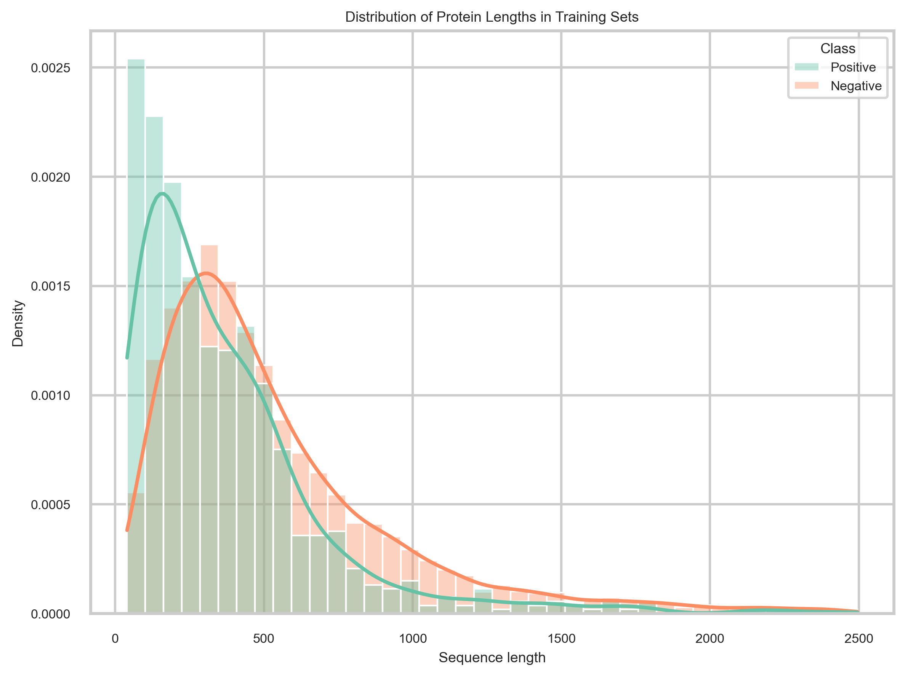
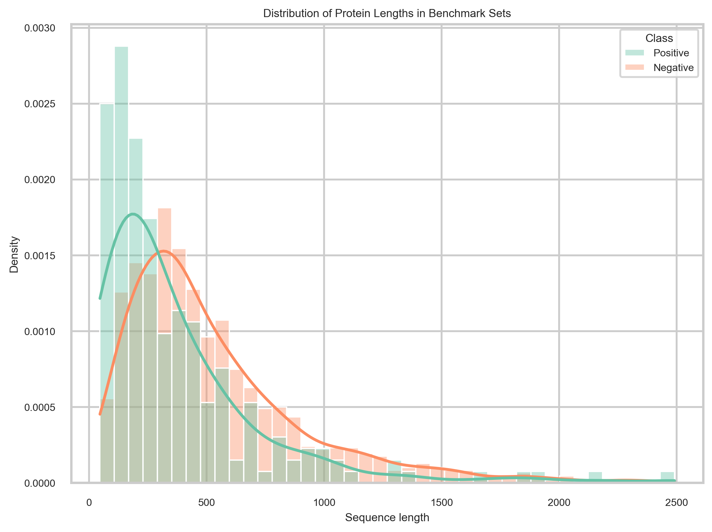
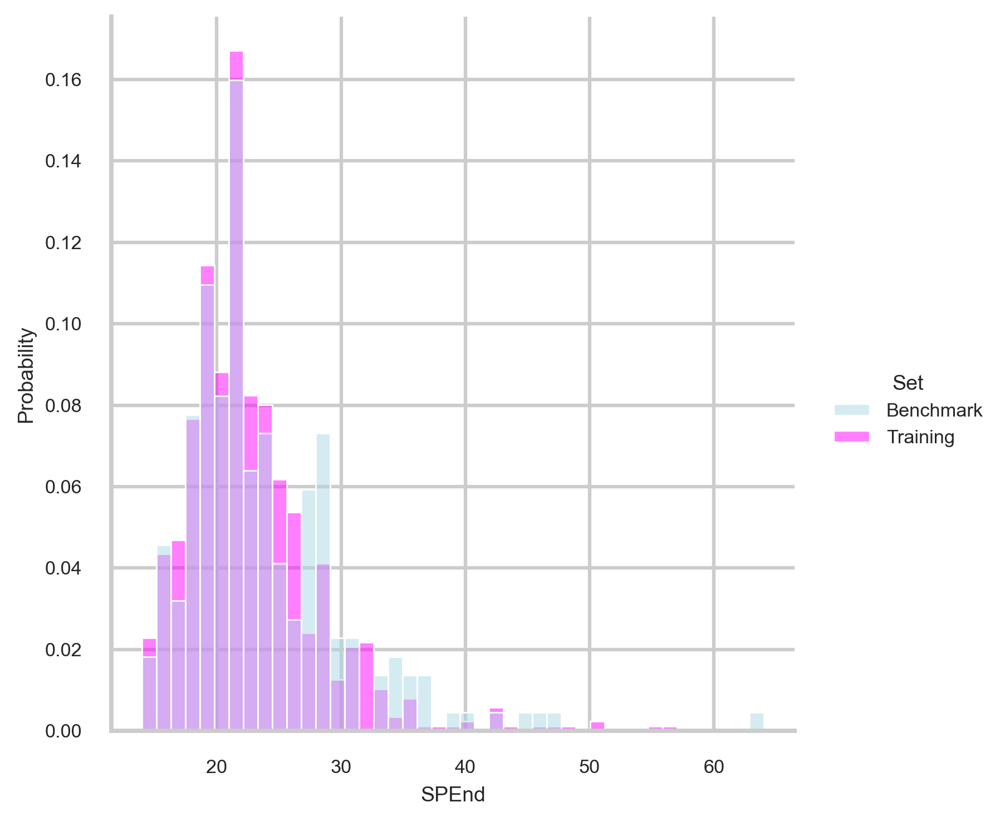
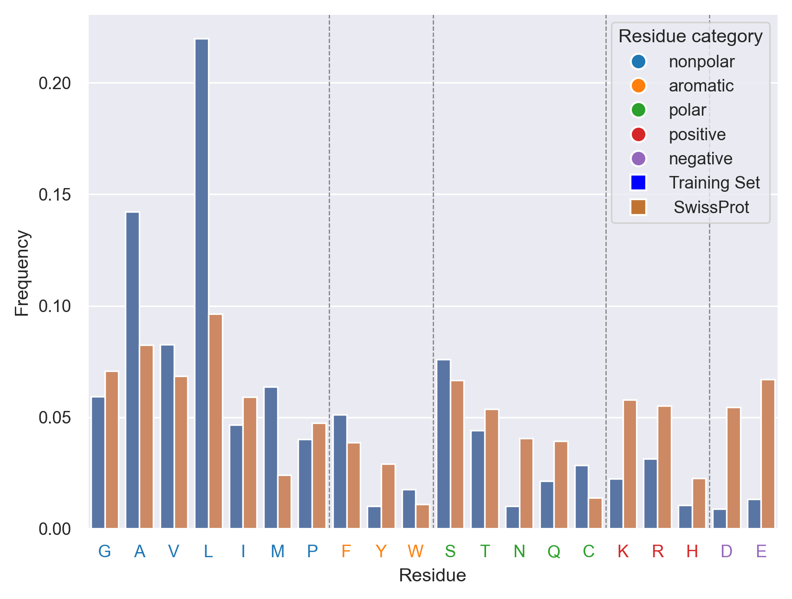
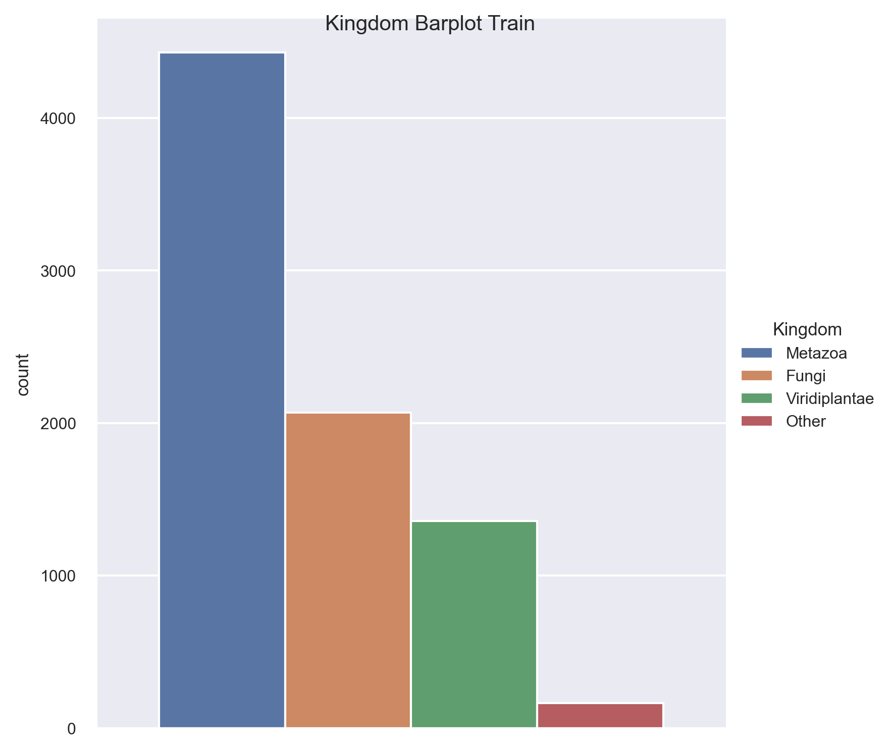
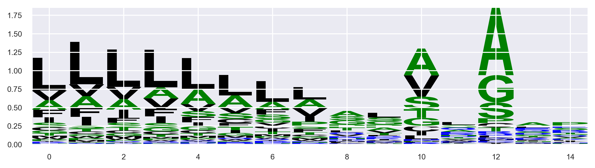

# Data Analysis of Signal Peptide Datasets

This section describes the exploratory analysis carried out on the curated dataset before feature extraction and model building. The purpose of this step was to verify that the training and benchmark sets were biologically coherent, comparable to one another, and suitable for downstream prediction tasks.

All analyses in this step were generated from the processed dataset in `../2.Data_Preparation/train_bench.tsv` using `plots.ipynb`.

---

## What was analyzed

The exploratory analysis focused on five main questions:

1. Do proteins with and without signal peptides differ in overall sequence length?
2. Are signal peptide lengths consistent across training and benchmark sets?
3. Does the amino acid composition of signal peptides reflect known biological properties?
4. Is the dataset taxonomically representative after preprocessing and splitting?
5. Do cleavage-site motifs show the expected conserved pattern?

Only the most representative figures are included below.

---

## 1. Protein sequence length

The first analysis compares the length of full protein sequences in the training and benchmark sets. Because a limited number of very long proteins can compress the scale, filtered distribution plots were used to make the central trends easier to interpret.

### Training set

### Benchmark set

### Interpretation

These plots show that the positive and negative classes do not have exactly the same length profile. Negative proteins cover a broader range and include more long sequences, whereas positive proteins tend to be somewhat more compact. The benchmark set follows the same overall pattern observed in training, which suggests that the split is structurally consistent and appropriate for later model evaluation.

---

## 2. Signal peptide length

For positive proteins, the annotated `SPEnd` position was used to examine the distribution of signal peptide lengths. This step was included to verify that the positive class reflects the expected biological size range of signal peptides.

### Interpretation

Most signal peptides fall within the expected range, with the main peak around 20–25 residues. The similarity between training and benchmark distributions is important because it indicates that the evaluation set was not drawn from a substantially different positive population.

---

## 3. Amino acid composition

The amino acid composition of signal peptide regions was then compared with Swiss-Prot reference frequencies. This analysis helps determine whether the dataset captures the characteristic enrichment of hydrophobic residues in signal peptides.

### Interpretation

The composition profile shows the expected enrichment in hydrophobic residues, which is one of the defining features of signal peptides. This is biologically consistent with their role in membrane targeting and supports the use of residue composition as an informative feature in later prediction models.

---

## 4. Taxonomic composition

To check whether preprocessing and splitting altered the biological composition of the dataset, the proteins were grouped by kingdom and visualized in the training and benchmark partitions.

### Interpretation

The dataset is dominated by eukaryotic groups, especially Metazoa, with additional representation from Fungi, Viridiplantae, and other eukaryotic categories. The benchmark set remains broadly consistent with the training data, reducing the risk that later evaluation results are driven by an unintended taxonomic shift.

---

## 5. Cleavage-site sequence logo

Finally, a sequence logo was generated from aligned windows around the annotated cleavage sites in the positive proteins. This provides a compact visual summary of residue preferences near the cleavage region.

### Interpretation

The sequence logo highlights conserved residue preferences around the cleavage site, including enrichment of small, neutral residues close to the cleavage position. This agrees with the known biological rules of signal peptide processing and confirms that the positive annotations are coherent and suitable for downstream modeling.

---

## Final remarks

Overall, the exploratory analysis shows that the dataset is biologically plausible and well structured for the next stages of the project. The main properties expected for signal peptides are clearly visible:

- realistic signal peptide length distribution
- amino acid composition distinct from general protein background
- conserved cleavage-site motif
- comparable training and benchmark sets after preprocessing

This step therefore provides a solid descriptive basis for feature extraction, position-specific scoring approaches, and machine-learning models.

---

## Files used in this step

**Main notebook**
- `plots.ipynb`

**Input dataset**
- `../2.Data_Preparation/train_bench.tsv`

**Figure folders**
- `1,2.Sequence_lengths_comparison/`
- `3.AA_Comparison/`
- `4.Taxonomy_classification/`
- `5.SequenceLogo/`
